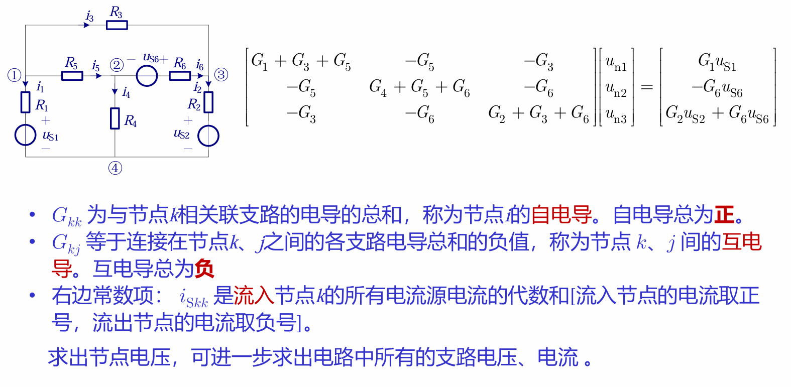

# 视觉预测现状研究

## 如何具体实现采样一个随机潜在变量？ 

### VAE相当于结合一个随机变量来预测下一帧，然后根据下一帧的情况去怎么根据已有帧学习给出随机变量的分布 

#### 2. 通过对抗性训练隐式学习分布 (GANs) 

生成对抗网络（GANs）则从一个完全不同的角度解决了这个问题。它没有显式地对随机性进行建模，而是通过一个巧妙的“博弈”过程，迫使模型不得不生成清晰的图像。

具体实现方式：视频生成对抗网络

开创性的工作，如 Vondrick 等人提出的模型，展示了 GANs 在视频预测中的实现方式 ^^：

* ​模型构成​：GANs 包含两个相互竞争的神经网络 ^^：
  1. ​生成器 (Generator)​：接收一个随机噪声向量作为输入，并尝试生成看起来真实的视频序列 ^^。
  2. ​判别器 (Discriminator)​：其任务是区分输入的视频是来自真实数据集，还是由生成器伪造的“假”视频 ^^。
* ​训练过程​：在训练中，生成器和判别器进行一场“零和游戏”。生成器不断学习如何生成更逼真的视频来“欺骗”判别器，而判别器则不断提升其辨别真伪的能力 ^^。
* ​如何解决模糊问题​：这个对抗过程是解决模糊问题的关键。一个模糊的、细节缺失的图像是多个可能未来的“平均值”，在真实世界中是不存在的。因此，一个训练有素的判别器会非常容易地将这种模糊图像识别为“假的”。为了赢得这场博弈，生成器被迫从所有可能性中选择一个具体的、清晰的场景来生成，因为只有清晰的图像才有机会骗过判别器 ^^。
* ​关键创新：前景-背景分离​：为了让生成的动态更加真实，Vondrick 等人的模型还采用了一种​双流架构​，将场景显式地分解为静态的背景和动态的前景 ^^。一个流负责生成一个在时间上保持不变的静态背景，而另一个流则生成移动的前景物体及其对应的时空掩码。最终的视频由这两部分合成。这种设计强制模型学习哪些物体应该移动，哪些应该保持静止，从而显著减少了背景的闪烁，使动态看起来更合理 ^^。
* 如果它试图用可以自由变化的前景流去画整幅画面（包括天空和大海），那么要保证广阔的天空和大海在几十帧里都保持绝对的稳定、不闪烁，是极其困难的。判别器会很容易发现这些细微的瑕疵并判定为“假”。
* 一个“聪明”得多的策略是：利用那个被限制只能生成静态图像的背景流来画天空和大海。因为这个流的输出在时间上是恒定的，所以背景自然就完美地保持了静止，不会有任何闪烁 ^^。然后，只在“人”走动的那一小块区域，使用灵活的\
  前景流和掩码流来绘制动态内容。

#### 视频预测Transformer (VPTR) 

时间窗口序列处理？

#### 图 (a): VPTR-FAR (完全自回归模型) 

输入的特征图在这里被切分成小块，注意力机制只在每个小块内部计算 ^^。这能高效地捕捉局部空间细节，例如物体的轮廓和纹理。旁边的2D PE​ (Positional Encoding) 是为了让模型知道每个像素在二维图像中的位置 ^^。

​Conv FFN​：这是一个基于卷积的前馈网络。它的主要作用是在Local spatial MHSA​处理完各个独立的局部小块后，帮助这些小块之间交换信息，从而获得更全局的视野 ^^。

​Temporal MHSA​ (绿色块)​：这是处理时间信息的第二步。在这一层，模型会观察在同一个空间位置上的特征是如何随着时间的推移而变化的，从而理解物体的运动模式 ^^。

* ​关键点​：注意这个模块旁边的​时钟图标​。在VPTR-FAR中，这个图标代表使用了时间注意力掩码 (temporal attention mask) ^^^^^^^^。这意味着在预测第\
  t 帧时，模型只能看到第 t−1 帧以及之前的信息，不能“偷看”未来的帧，这保证了其自回归的特性。旁边的 1D PE​ 是为了让模型理解帧的先后顺序 ^^^^^^^^。

​MLP FFN​：最后通过一个标准的前馈网络进行最终的特征变换。

​​

<figure><figcaption></figcaption></figure>

#### 图 (b): VPTR-NAR (非自回归模型) 

**左半部分: 编码器 TE​ (负责总结过去)**

1. ​输入 (绿色方块 z1,...,zL)​: 编码器只接收历史帧的特征 ^^。
2. ​处理流程​: 它内部也是一个 Nx​ 堆叠的VidHRFormer模块。但请注意，它的 Temporal MHSA​ 模块旁边的​时钟图标是完整的​，表示没有使用时间掩码 ^^。因为编码器的任务是充分理解和总结整个历史，所以它内部的信息可以自由地前后交互。
3. ​输出 (橙色方块 e1,...,eL)​: 编码器的输出被称为“​记忆 (memories)​” ^^。这是对所有过去 L 帧视频信息的一个高度浓缩和精炼的总结。

**右半部分: 解码器 TD​ (负责生成未来)**

解码器的工作是利用编码器总结的“记忆”来并行地生成所有未来帧。

1. ​输入 (两个来源)​：
   * ​查询信号 (灰色方块 qL+1,...,qL+N)​：这是解码器的主要输入，位于最底部。它们是一组可学习的“空白模板”，每一个 qt​ 都将负责生成对应的未来帧 z^t​ ^^。
   * ​来自编码器的“记忆” (橙色方块 et)​: 这是解码器的第二个输入，从左边连接过来。
2. ​处理流程​:
   * 解码器底部的 Local spatial MHSA​ 和 Conv FFN​ 首先对“查询信号” qt​ 本身进行处理。
   * 接下来的第一个 Temporal MHSA​ 层让这 N 个查询信号之间相互通信，以协调它们将要生成的动作。
   * ​最关键的一步：第二个 Temporal MHA​ 层​。这一层被称为编码器-解码器注意力 (encoder-decoder attention) ^^。
     * 它的查询 (Query, Q) 来自于下面的查询信号 qt​。
     * 但它的\
       键 (Key, K) 和 值 (Value, V) 来自于编码器输出的“记忆” et ^^。
     * ​工作原理​: 在这里，每一个“查询信号” qt​ 都会去“查阅”编码器总结的全部历史信息 et​，并从中提取出对自己生成第 t 帧最有用的信息。由于每个 qt​ 都是独立地去查阅，所以这个过程是并行的。
3. ​输出 (蓝色方块 z^L+1,...,z^L+N)​：
   * 经过解码器所有层的处理后，“空白模板”\
     qt​ 被填充成了包含具体内容的未来帧特征 z^t​。整个序列是一次性同时生成的 ^^。

> **直观理解：这是一个“问题精炼”的过程**
>
> 您的理解非常到位：“相当于对查询进行处理”。我们可以用一个生动的比喻来理解这个过程：
>
> * ​初始查询信号 qt​：可以看作一个刚入行的、经验不足的实习记者。他接到一个任务：“去采访一位目击证人（即编码器输出的‘记忆’ et​），了解一下过去发生了什么，并写一篇关于未来的报道。” 这位实习记者脑子里只有一个非常模糊、宽泛的问题：“请问发生了什么？”
> * ​下面的处理层 (您所问的整个模型部分)​：这就是对这位实习记者进行岗前培训和问题精炼的过程。
>   1. ​Local spatial MHSA​：首先，我们让他整理自己的笔记（对他自己的查询信号 qt​ 进行空间自注意力），确保他对“案发现场”（即图像空间）的各个位置有一个基本的、结构化的认知。
>   2. ​Conv FFN​：让他把不同位置的笔记信息串联起来，形成更全面的理解。
>   3. ​第一个 Temporal MHSA​：这是最关键的培训。让他和团队里其他 N-1 位记者（其他的查询信号）开一个“​选题策划会​”（查询信号之间的自注意力）。记者们会相互沟通、协调，避免提出重复或矛盾的问题。例如，负责第11帧的记者说：“我主要问证人车辆是怎么出现的”，那么负责第12帧的你就会调整自己的问题为：“好的，那我接着问车辆后续的移动方向”。
> * ​最终输出的 Q​：经过这一整套“培训和策划”之后，这位实习记者不再是只会问“发生了什么？”的菜鸟了。他现在胸有成竹，带着一个​经过深思熟虑、信息量巨大、且与同事协调好的、极具针对性的问题​。这个​精炼后的问题​，就是最终输入到下一个注意力层的 ​Q (Query)​。

#### 自回归（AR）与非自回归（NAR）模型之间的分野，揭示了视频预测领域一个根本性的权衡：质量与延迟/可控性之间的权衡。AR模型通常能生成逐帧质量更高、更连贯的序列，但其串行生成方式导致推理速度慢，且容易出现误差漂移。NAR模型速度快，可并行化，但保证帧间一致性更具挑战性。 

### Diffusion Model 

#### （视频学习） 

#### Mike Show 

1. 不是一次到位，直接算出无噪声的图像。发现效果不好，选择在算出来之后人为加入一次噪声，使得下一次再次进行运算，但是噪声程度减小了。
2. DDPM or DDIM

| 特性    | DDPM (Denoising Diffusion Probabilistic Models) | DDIM (Denoising Diffusion Implicit Models) |
| ----- | ----------------------------------------------- | ------------------------------------------ |
| 核心思想  | 基于马尔可夫过程的概率模型                                   | 基于非马尔可夫过程的隐式生成模型                           |
| 采样速度  | 非常慢(例如 1000+ 步)                                 | 非常快(例如 20-100 步)，实现10-50倍加速                |
| 采样过程  | ​随机的 (Stochastic)​，必须一步步进行                      | ​可以是确定性的 (Deterministic)​，允许“跳步”采样         |
| 模型兼容性 | -                                               | 可以直接使用DDPM训练好的模型，无需重新训练                    |
| 生成质量  | 步数多，质量高                                         | 在少量步数下，可以达到和DDPM上千步媲美的质量                   |

DDPM的训练只做一件事：教会一个神经网络去预测噪声

* 把这张“题目”（噪声图片 xt​）和“题目的难度”（噪声等级 t​）一起交给神经网络。
* 要求神经网络猜出我们当初用来制造这张噪声图片的那个“标准答案”（随机噪声 ϵ）。

**训练时需要拟合上一步的图像吗？**

回答：完全不需要。虽然两个目标（猜噪声 vs 猜前一步图像）最终能达到同样的效果，但“猜噪声”这个学习任务更简单、更直接、更稳定。

DDIM的训练，增加了一个含参数η的项，允许认为设置情况

它让你能够自由地、精确地调节在生成图片的过程中，每一步要加入多少新的、随机的噪声。这个旋钮的“刻度”范围从0到1，不同的设置会产生截然不同的效果，也正是这个旋钮，完美地将DDIM和DDPM统一到了一个框架下。

* ​要速度和复现性​：就设置 η=0。
* ​要理论分析或复现DDPM​：就设置 η=1。
* ​想在质量和多样性上做些探索​：就在0和1之间取值。

#### 李宏毅 

**图像生成原理：**

思路：利用输入的文字或图片，模型给出一个图影片的向量空间，在这个空间取样作为输出。优化模型给出的向量空间，尽可能接近我的数据集。

学习如下：数据集里面取样，使得我的模型预测出的向量空间中包含这个样本的可能性最大化。数学上与KL散度等价：判断计算出的向量空间和真实空间的KL散度

#### （Gemini综述）2025年生成式AI格局：扩散模型的崛起与新一轮架构竞争 

关于这篇综述，可能存在的问题：

1. 什么是VAE。将动作向量离散化，减少信息量的同时可以接受损失程度，是一件利大于弊的事情，但是如果试图吧一张256×256的图像可以被压缩成一个32×32×4的潜在张量然后去进行处理是不是存在失真的问题？
2. 划分为“补丁”，这个思想就是tokenization？那和ViT有什么区别吗？
3. 自适应层归一化的详细内容？这是啥？多模态吗？“上下文内条件化”（in-context conditioning）是多模态的一种可能方式？
4.  这一发现验证了一个关键论点：对于生成质量而言，有效的计算量比单纯的参数量更为重要。例如，DiT-XL/2模型在ImageNet 256×256图像生成任务上取得了2.27的FID分数，不仅超越了所有先前的扩散模型，包括基于U-Net的领先模型ADM和LDM，而且是在潜在空间以更低的计算成本实现的 ^^。这有力地证明了，对于扩散模型而言，Transformer是一个比U-Net更具可扩展性的主干网络。

    这是在干什么？其中蕴含着什么思想？
5.
